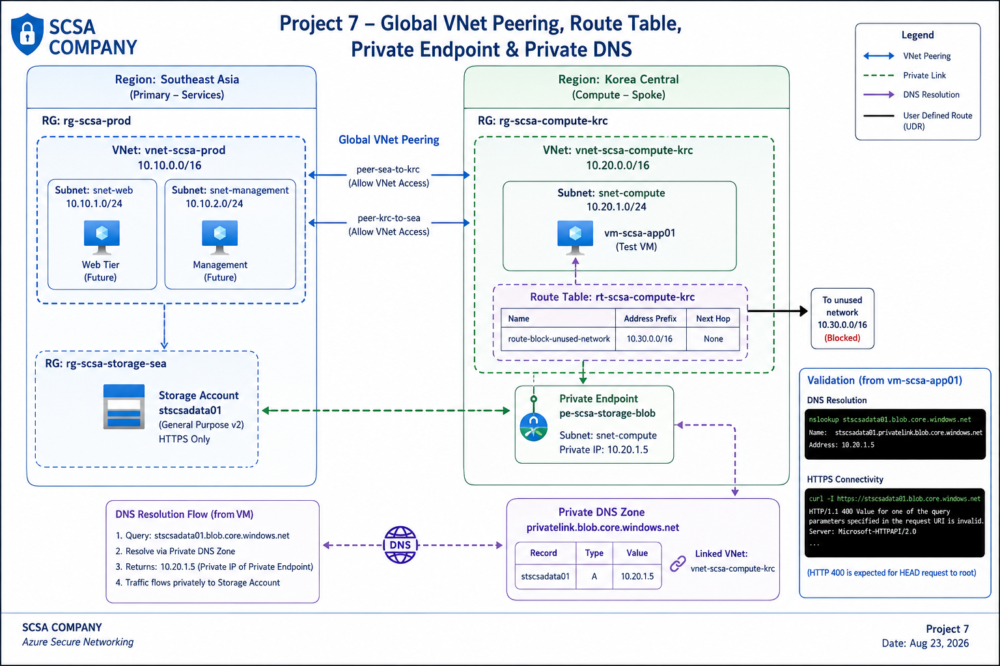

# SCSA Company – Project 7: Azure Secure Networking and Private Connectivity

## Project Overview

This project implements advanced Azure networking controls for the SCSA Company environment.

The objective was to extend the existing SCSA network design beyond basic VNet and NSG configuration by implementing:

- Global VNet Peering
- User Defined Routes (UDRs)
- Azure Private Endpoint
- Azure Private DNS
- Private service name resolution
- Private connectivity validation
- Cost-conscious network design

The project demonstrates how Azure administrators can connect VNets across regions, influence traffic routing, and provide private access to Azure PaaS services without relying on public service endpoints.

---

## Business Scenario

SCSA Company already operates Azure resources across multiple regions.

Existing resources include:

- `vnet-scsa-prod` in Southeast Asia
- `vnet-scsa-compute-krc` in Korea Central
- `vm-scsa-app01` in Korea Central
- `stscsadata01` in Southeast Asia

SCSA required a more secure networking design that could:

- Connect regional VNets privately
- Control specific traffic paths
- Provide private connectivity to Azure Storage
- Resolve Azure service names to private IP addresses
- Avoid unnecessary use of expensive networking services

The solution was designed to reinforce practical AZ-104 networking concepts while remaining cost-conscious.

---

## Architecture

The architecture includes:

- Global VNet Peering
- Route Table / User Defined Route
- Storage Private Endpoint
- Private DNS Zone
- VNet DNS Link
- VM-based DNS validation
- HTTPS connectivity validation

---

## Existing Network Environment

### Southeast Asia VNet

`vnet-scsa-prod`

Address space:

`10.10.0.0/16`

Existing subnets include:

- `snet-web` – `10.10.1.0/24`
- `snet-management` – `10.10.2.0/24`

### Korea Central VNet

`vnet-scsa-compute-krc`

Address space:

`10.20.0.0/16`

Compute subnet:

`snet-compute`

Address prefix:

`10.20.1.0/24`

The application server `vm-scsa-app01` is connected to this subnet.

---

## Global VNet Peering

The two SCSA VNets are located in different Azure regions.

Because of this, the connectivity uses Global VNet Peering.

The following peering objects were created:

### Southeast Asia to Korea Central

`peer-sea-to-krc`

### Korea Central to Southeast Asia

`peer-krc-to-sea`

Both peering connections reached:

`Connected`

Virtual network access was enabled in both directions.

---

## Why Global VNet Peering

VNet Peering allows Azure VNets to communicate privately using the Microsoft backbone network.

Global VNet Peering extends this capability across Azure regions.

The SCSA architecture uses:

`Southeast Asia ↔ Korea Central`

The VNet address spaces do not overlap:

- `10.10.0.0/16`
- `10.20.0.0/16`

Non-overlapping address spaces are required for successful VNet peering.

---

## Route Table and User Defined Route

A custom route table was created:

`rt-scsa-compute-krc`

The route table was associated with:

`snet-compute`

A test User Defined Route was added:

| Setting | Value |
|---|---|
| Route Name | route-block-unused-network |
| Destination | 10.30.0.0/16 |
| Next Hop | None |

The `10.30.0.0/16` network was intentionally selected because it was not used anywhere in the current SCSA Azure environment.

Using the `None` next hop causes matching traffic to be dropped.

---

## User Defined Route Purpose

Azure automatically creates system routes for virtual networks.

User Defined Routes allow administrators to supplement or override Azure's default routing decisions for selected destination prefixes.

The SCSA test route demonstrates:

`10.30.0.0/16 → None`

This means any traffic matching that destination is discarded.

The route does not affect:

- `10.10.0.0/16`
- `10.20.0.0/16`
- Existing Internet connectivity
- Existing application connectivity

---

## Azure Private Endpoint

A Private Endpoint was created for the Blob service of:

`stscsadata01`

Private Endpoint:

`pe-scsa-storage-blob`

Private Link connection:

`psc-scsa-storage-blob`

Group:

`blob`

The connection state was:

`Approved`

---

## Private Endpoint Network Placement

The Private Endpoint was created in:

`vnet-scsa-compute-krc`

Subnet:

`snet-compute`

Private IP:

`10.20.1.5`

This provides the Azure Storage Blob service with a private IP address inside the Korea Central VNet.

The Storage account itself remains in Southeast Asia.

---

## Private Endpoint vs Service Endpoint

Azure Service Endpoints and Private Endpoints solve similar but different networking problems.

### Service Endpoint

The Azure PaaS service continues to use its public endpoint.

The service can restrict access to selected Azure VNets or subnets.

### Private Endpoint

The Azure service receives a private IP address inside the customer's VNet.

For SCSA:

`stscsadata01 Blob → 10.20.1.5`

This allows the application VM to access the service using private connectivity.

---

## Private DNS

A Private DNS zone was created:

`privatelink.blob.core.windows.net`

A VNet link was created:

`link-scsa-compute-krc`

The DNS zone was linked to:

`vnet-scsa-compute-krc`

Automatic registration was disabled because this zone is used for Azure Private Link name resolution rather than VM hostname registration.

---

## Private DNS Zone Group

The Private Endpoint was associated with the Private DNS zone using:

`dzg-scsa-storage-blob`

Azure created the following A record:

`stscsadata01.privatelink.blob.core.windows.net`

Private IP:

`10.20.1.5`

---

## DNS Resolution Validation

DNS resolution was tested from inside:

`vm-scsa-app01`

The normal Azure Storage hostname was queried:

`stscsadata01.blob.core.windows.net`

The result returned a canonical name:

`stscsadata01.privatelink.blob.core.windows.net`

which resolved to:

`10.20.1.5`

This confirmed that the VM was resolving the Azure Storage service through the Private DNS zone and Private Endpoint.

---

## DNS Resolution Flow

The validated resolution path was:

`vm-scsa-app01`

→ Query `stscsadata01.blob.core.windows.net`

→ Azure DNS / Private DNS resolution

→ `stscsadata01.privatelink.blob.core.windows.net`

→ `10.20.1.5`

→ Private Endpoint

→ Azure Storage Blob service

---

## HTTPS Connectivity Validation

HTTPS connectivity was tested from `vm-scsa-app01` using:

`curl -I https://stscsadata01.blob.core.windows.net`

Azure Storage returned:

`HTTP/1.1 400`

This response was expected for the test because the request targeted the Blob service root without a valid Blob/container operation.

The important result is that:

- DNS resolved privately
- HTTPS connectivity succeeded
- Azure Storage responded

This confirmed that the VM could reach the Storage Blob service through the configured private networking path.

---

## Private DNS Importance

Private Endpoint connectivity relies on correct DNS resolution.

Without Private DNS, an application may continue resolving the normal Azure service hostname to a public service endpoint.

Private DNS allows applications to continue using the standard service hostname while Azure resolves it to the Private Endpoint's private IP.

In this project:

`stscsadata01.blob.core.windows.net`

ultimately resolves to:

`10.20.1.5`

---

## Cost-Conscious Network Design

The project intentionally avoided expensive Azure networking services.

The following services were not deployed:

- Azure Firewall
- VPN Gateway
- ExpressRoute
- NAT Gateway
- Application Gateway

The project instead focused on:

- VNet Peering
- Route Tables
- Private Endpoint
- Private DNS

The VM was started only for validation and deallocated immediately after testing.

---

## Troubleshooting

### SSH Private Key Missing

When attempting to reconnect to `vm-scsa-app01`, the Cloud Shell private key from the previous session no longer existed.

SSH returned:

`Permission denied (publickey)`

A new SSH key pair was generated and the VM user's authorized public key was updated.

This demonstrated the difference between:

- Network connectivity
- SSH authentication

---

### Private DNS Resolution

The Azure Private DNS configuration was validated from inside the VM using:

`nslookup`

The normal Storage Blob hostname correctly returned the Private Link hostname and private IP.

This confirmed that the DNS zone, VNet link, DNS zone group, and Private Endpoint were working together.

---

### HTTP 400 During Connectivity Test

The HTTPS test returned:

`HTTP/1.1 400`

This did not indicate a network failure.

The response showed that Azure Storage had received the request, but the root Blob endpoint required a valid storage operation or request parameters.

The test therefore successfully demonstrated service reachability.

---

## Security Design

The networking design reduces unnecessary public service exposure by using:

- Private Endpoint connectivity
- Private DNS resolution
- Non-overlapping VNet address spaces
- Controlled cross-region VNet Peering
- Explicit route-table configuration
- Existing NSG protections
- Temporary VM runtime for validation only

The project also avoids exposing subscription IDs or credentials in portfolio screenshots and scripts where possible.

---

## Implementation

The project was implemented primarily using Azure CLI.

### Deployment Scripts

- [01-global-vnet-peering.sh](./scripts/01-global-vnet-peering.sh) – Creates Global VNet Peering in both directions.
- [02-route-table-udr.sh](./scripts/02-route-table-udr.sh) – Creates and associates a route table with a custom UDR.
- [03-private-endpoint.sh](./scripts/03-private-endpoint.sh) – Creates the Storage Blob Private Endpoint.
- [04-private-dns.sh](./scripts/04-private-dns.sh) – Creates the Private DNS zone, VNet link, and DNS zone group.
- [05-private-connectivity-validation.sh](./scripts/05-private-connectivity-validation.sh) – Validates DNS resolution and HTTPS connectivity from the VM.
- [06-final-validation.sh](./scripts/06-final-validation.sh) – Validates Private Endpoint and Private DNS configuration.

---

## Implementation Evidence

Screenshots are available in the [`screenshots`](./screenshots/) directory.

Evidence includes:

1. Global VNet Peering
2. Route Table and UDR
3. Storage Private Endpoint
4. Private DNS validation
5. VM-side private DNS resolution
6. Private Endpoint HTTPS connectivity

---

## Skills Demonstrated

- Azure Virtual Networks
- Global VNet Peering
- Cross-region networking
- Azure Route Tables
- User Defined Routes
- Azure system routing concepts
- Longest-prefix route matching
- Azure Private Link
- Azure Private Endpoint
- Azure Storage private connectivity
- Azure Private DNS
- Private DNS zones
- VNet DNS links
- Private DNS zone groups
- DNS resolution
- Linux network validation
- SSH administration
- HTTPS connectivity testing
- Azure CLI
- Secure cloud networking
- Cost-conscious network architecture
- Infrastructure troubleshooting
- Cloud infrastructure documentation

---

## Project Status

**Completed**

SCSA Company now has a more secure Azure networking architecture that combines cross-region VNet connectivity, controlled routing, and private access to Azure Storage.

The environment successfully demonstrated Global VNet Peering, a User Defined Route, a Storage Private Endpoint, Private DNS resolution, and VM-based private connectivity validation.

This project extends the SCSA environment from basic Azure networking into advanced private connectivity and network governance.
